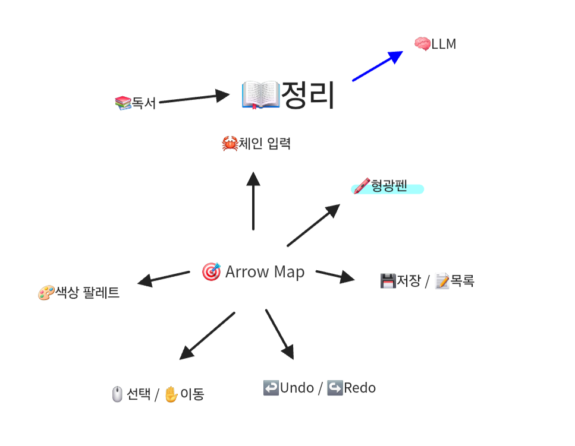
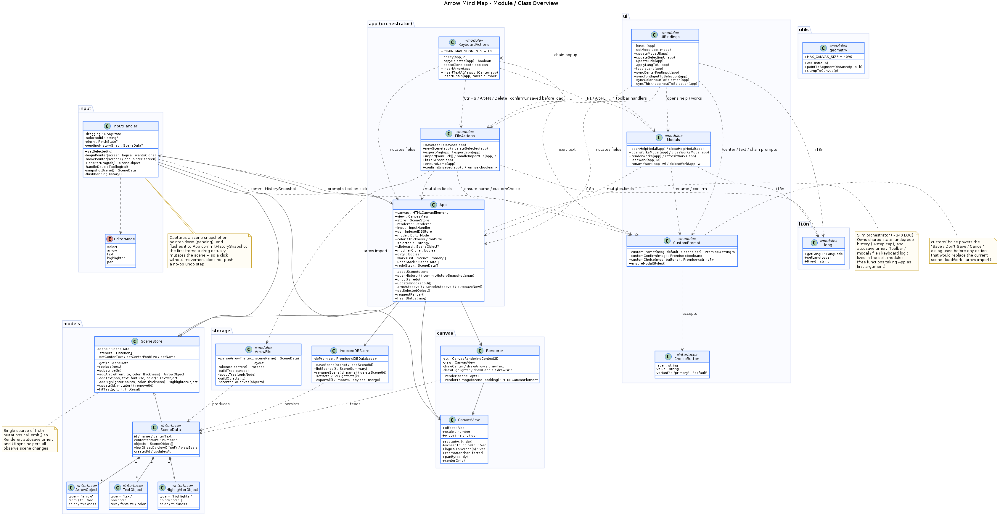
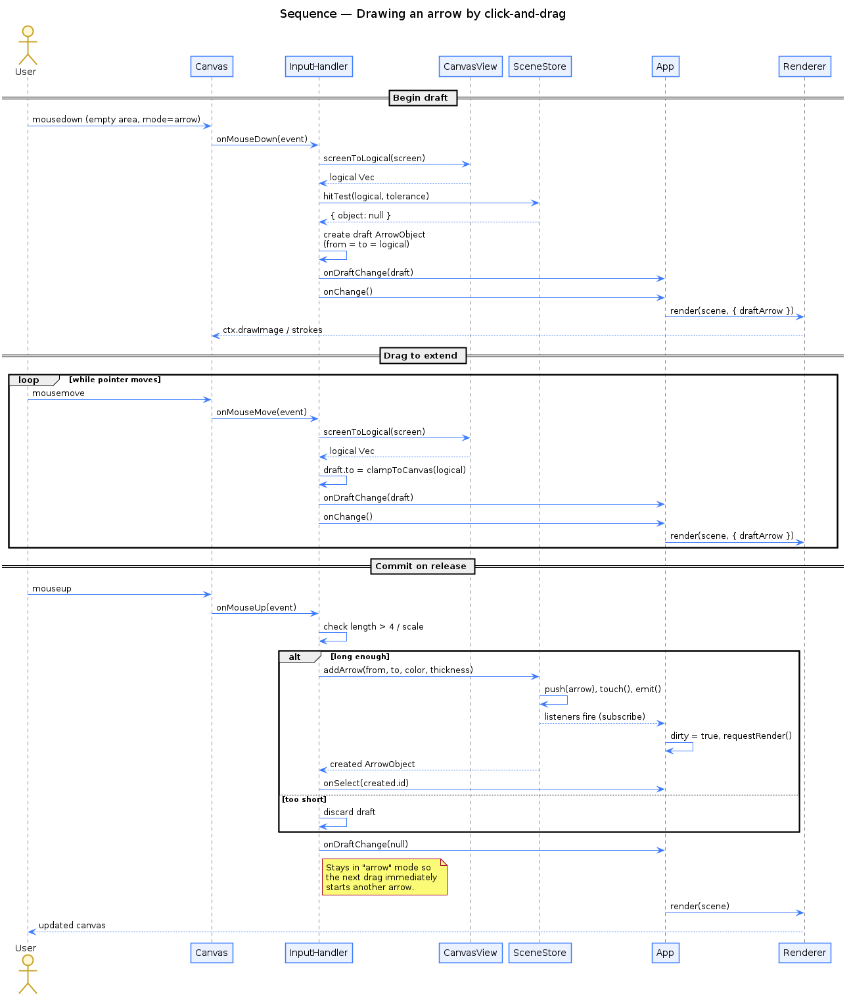
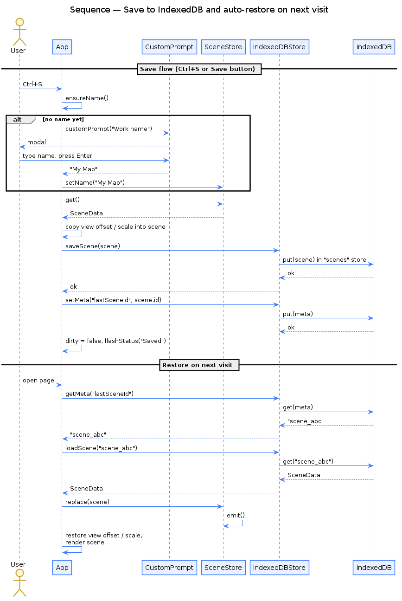

# 화살표 마인드맵 (Arrow Mind Map)

HTML5 Canvas + TypeScript 기반의 변형 마인드맵 웹앱입니다.
**화살표 · 글자 · 형광펜** 세 가지 객체만으로 가운데 주제로부터 생각을 펼칠 수 있습니다.

> "Arrow" only mind map — a Canvas-based mind mapping tool that supports
> arrows, text, and highlighter strokes radiating from a single center topic.

## 예시 — 우리 앱으로 우리 앱 소개하기

아래 마인드맵은 본 저장소의 `docs/arrow.arrow` 한 파일을 📥 가져오기로 불러와 만든 결과입니다.
실제 앱이 생성한 PNG를 그대로 임베드했으므로, 동일한 결과를 재현하려면 `docs/arrow.arrow`를 앱에서 가져오기만 하면 됩니다.



PNG는 앱의 🖼️ "PNG 내보내기" 버튼으로 직접 저장하거나, `scripts/arrow2png.ts`로 JSON 씬에서 생성할 수 있습니다 (`npm install canvas` 필요):

```sh
tsc -p scripts/tsconfig.json
node scripts/arrow2png.js <scene>.json <out>.png
```

`scripts/arrow2png.ts`는 출력 확장자(`.png` / `.svg`)에 따라 렌더 경로를 분기합니다.
SVG 경로는 `node-canvas` 없이도 동작하므로 어떤 환경에서든 즉시 결과를 볼 수 있습니다.

## `.arrow` 텍스트 포맷

📥 가져오기 버튼은 `.json` (DB 전체 백업) 외에 `.arrow` (단일 씬 텍스트) 도 받습니다.
한 줄에 하나의 체인을 적으면 자동으로 트리 레이아웃이 됩니다 — 키보드만으로 빠르게 씬을 짤 때 편합니다.

```
arrow                                   # 첫 줄: 파일 마커
Book                                    # 둘째 줄: 주제 (centerText)
Book -> 무협지 -> 김용                    # 체인. -> 또는 → 둘 다 가능
Book -> 판타지 -> 뱀뱀이
Book -> 잡지 -> PC 사랑 -> 2026.05
할일 -> 이발 -> 13000                    # 'Book'에 속하지 않는 새 시작점 — 자동으로 또 하나의 가지로 추가
# '#'은 주석 (줄 끝까지)
```

규칙:
- 시작점이 기존 노드(주제 또는 이전 체인에서 등장한 단어)면 거기서 가지를 이어 붙입니다.
- 시작점이 새 단어면 주제의 또 다른 자식 가지로 추가됩니다.
- 각 부모는 자식 N개를 360°/N 간격으로 시계 방향 회전하며 배치 — 한 자식만 있으면 부모의 바깥 방향으로 일직선.
- 글자 크기는 24로 통일.

샘플 파일: `docs/examples/spec.arrow` — 그대로 가져오면 위 사양 그림이 그려집니다.

## 주요 기능

- 🎯 **가운데 주제**: 캔버스 중앙에 주제 텍스트, 글자 크기까지 자유롭게 편집
- ➡️ **화살표 그리기**: 빈 곳을 클릭/드래그하여 화살표 추가
  - 끝점 핸들로 방향과 길이 조절, 가운데 핸들로 통째 이동
  - `Insert` / `+` 누르면 자동 위치/길이로 즉시 추가
- 🔤 **글자 객체**: 단어/문장 입력 후 이동 및 크기 조절 가능
- 🖍️ **형광펜 (Highlighter)**: 반투명 폴리라인으로 강조 표시. 점 하나 탭으로 마커처럼 찍기도 가능
  - `Ctrl/⌘` 누른 채 드래그하면 **직선 형광펜** (자/박스/밑줄 강조에 유용)
- 🎨 **16색 빠른 팔레트** (데스크톱) + 표준 색상 선택기
- 🔍 **확대/축소**: 마우스 휠, ＋/－ 버튼, 모바일 두 손가락 핀치 줌
- 📐 **고정 4096×4096 캔버스** + 자유 패닝 (Shift+드래그 / 가운데 버튼 / "이동" 모드)
- ⏪ **실행 취소 / 다시 실행**: 최근 8단계까지 기억. `Ctrl/⌘+Z`(취소), `Ctrl/⌘+Y` 또는 `Ctrl+Shift+Z`(다시). 툴바의 ↩️ / ↪️ 버튼으로도 가능
  - 히스토리는 **현재 세션 메모리**에만 유지 — IndexedDB·JSON에 저장되지 않고 새로고침·다른 작업 로드 시 초기화
- 📋 **객체 클립보드**: `Ctrl/⌘ + C / V`로 선택 객체 복제 (내부 클립보드, 좌표 어긋남 자동)
- 🪄 **Ctrl + 드래그 = 복제 이동**: 본체를 끌면 즉시 복제 후 클론을 끌어감, 원본은 제자리
  - 모바일: 좌측 하단 둥근 **Ctrl 토글 버튼**으로 동일 동작 (형광펜 모드에서는 직선 모드 토글 겸용)
- 💾 **IndexedDB 저장**: 작업물 여러 개를 이름으로 관리, 이어하기 지원
  - **자동 저장**: 객체 변경 후 120초 뒤 백그라운드 저장. 탭/창 닫을 때 `beforeunload`/`pagehide`로 강제 저장하여 작업 손실 방지
  - 작업 목록 모달: 이름 변경 / 삭제 / 불러오기 / 이름순·최근수정순 정렬
  - 전체 작업물을 JSON으로 내보내기 / 가져오기
- 🔢 **글자 크기는 항상 정수**: 입력·리사이즈·DB/JSON 로딩 모두에서 `Math.floor`로 정규화 (레거시 소수값도 자동 복구)
- 🖼️ **PNG 내보내기**: 현재 작업을 고해상도 PNG로 저장
- 📥 **`.arrow` 텍스트 포맷 가져오기**: 한 줄 = 한 체인의 직관적 텍스트로 마인드맵 생성 (`docs/examples/spec.arrow` 참고)
- 🌐 **한국어 / 영어 인터페이스 토글**
- 📱 **PC + 모바일 터치 UI 지원**
- 🚫 **외부 라이브러리 없음** — `python -m http.server`로 바로 실행 가능

## 실행 방법

### 1. 개발 모드

```sh
python -m http.server 8001
```

이후 브라우저에서 [http://localhost:8001](http://localhost:8001) 열기.

### 2. 단일 파일 릴리즈 빌드

`release/index.html` 한 파일로 묶어 모든 외부 참조를 인라인합니다.

- macOS / Linux:
  ```sh
  ./build.sh
  ```
- Windows (한글 깨짐 방지를 위해 cp949 사용):
  ```bat
  build.bat
  ```

빌드 결과는 `release/index.html` 하나로 떨어지며, 더블 클릭만으로 열 수 있습니다.

## 아키텍처 다이어그램

### 모듈 / 클래스 구성 (Class Diagram)



`App`은 슬림한 오케스트레이터(~190 LOC)로 공유 상태와 라이프사이클만 가지며, 동작은 네 모듈로 분리되어 있습니다.

- `src/ui/UiBindings.ts` — 툴바 / 색상 팔레트 / 모드·언어·제목 동기화
- `src/ui/Modals.ts` — 도움말 / 작업 목록 모달
- `src/app/FileActions.ts` — 저장 · 불러오기 · 내보내기 · Fit
- `src/app/KeyboardActions.ts` — 단축키 · 클립보드 · 자동 삽입

각 모듈은 `App` 인스턴스를 첫 인자로 받는 free function 묶음입니다.
`SceneStore`는 단일 진실 공급원(single source of truth)이며 변경 이벤트를 통해 Renderer와 UI 계층이 동기화됩니다.

### 화살표 그리기 흐름 (Sequence — Drawing an arrow)



빈 영역에서 mousedown → drag → mouseup으로 이어지는 화살표 그리기 과정을 보여줍니다.
draft 상태는 `InputHandler`가 들고 있다가 release 시 `SceneStore.addArrow`로 commit합니다.
commit 후에도 화살표 모드를 유지하여 연속 그리기가 가능합니다.

### 저장 / 복원 흐름 (Sequence — Save & auto-restore)



`Ctrl+S` 또는 저장 버튼으로 IndexedDB에 저장하고, 다음 방문 시 `lastSceneId` 메타로부터 자동 복원하는 과정입니다.

> 다이어그램 소스(.puml)는 `docs/` 폴더에 있으며 다음 명령으로 재생성할 수 있습니다.
>
> ```sh
> plantuml -tpng docs/*.puml
> ```

## 디렉토리 구조

```
arrow/
├─ index.html                # 개발용 진입점 (dist/bundle.js 참조)
├─ dist/bundle.js            # 빌드된 단일 JS 번들 (손 유지 IIFE)
├─ src/                      # TypeScript 소스
│  ├─ main.ts
│  ├─ app.ts                 # 슬림 오케스트레이터 (~190 LOC)
│  ├─ app/
│  │  ├─ FileActions.ts      # save/load/export/new/delete/fit
│  │  └─ KeyboardActions.ts  # onKey/clipboard/insert helpers
│  ├─ ui/
│  │  ├─ UiBindings.ts       # 툴바 / 팔레트 / mode·lang·title 동기화
│  │  ├─ Modals.ts           # Help / Works 모달
│  │  └─ CustomPrompt.ts     # window.prompt 대체 모달
│  ├─ canvas/CanvasView.ts, Renderer.ts
│  ├─ models/types.ts, SceneStore.ts
│  ├─ input/InputHandler.ts
│  ├─ storage/
│  │  ├─ IndexedDBStore.ts
│  │  └─ ArrowFile.ts        # .arrow 텍스트 포맷 파서 + 트리 레이아웃
│  ├─ i18n/lang.ts
│  └─ utils/geometry.ts
├─ test/                     # 단위 테스트 (브라우저 + Node, 43개 케이스)
│  ├─ test_runner.html
│  ├─ test_arrow.js
│  └─ run_node.js
├─ scripts/
│  ├─ inline_build.py        # release 빌드 헬퍼
│  ├─ arrow2png.ts           # JSON 씬 → PNG/SVG 이미지 변환 (단일 파일)
│  └─ tsconfig.json          # 스크립트 전용 Node 타깃
├─ build.sh / build.bat
├─ docs/                     # 아키텍처 다이어그램 + intro 마인드맵 (SVG/JSON)
│  └─ examples/spec.arrow    # .arrow 포맷 샘플
├─ history.html              # 작업 이력 (브라우저에서 바로 열림)
├─ todo.html                 # 작업 항목 체크리스트 (브라우저에서 바로 열림)
└─ release/index.html        # 빌드 산출물 (단일 파일)
```

## 사용 안내

1. 상단의 **"화살표"** 버튼을 누른 뒤 캔버스 빈 곳을 드래그하면 화살표가 만들어집니다.
2. **"글자"** 모드에서 캔버스를 클릭하면 입력창이 열립니다.
3. **"형광펜"** 모드에서 자유 곡선처럼 끌어 강조 표시. 점 하나만 톡 찍어도 마커가 남습니다.
   - `Ctrl/⌘`을 누른 채 드래그하면 **직선 스트로크**가 그려집니다. 스트로크 도중 토글해도 즉시 직선/곡선이 전환됩니다.
4. 객체를 클릭하면 핸들이 나타납니다.
   - 화살표 끝점 — 방향/길이 조절
   - 화살표 중점 — 통째 이동
   - 글자 우하단 핸들 — 글자 크기 조절
5. 객체를 더블 클릭하면 글자 내용을 다시 입력할 수 있습니다.
6. 빈 곳을 더블 클릭하면 **가운데 주제 텍스트**를 편집합니다.
7. **`Ctrl/⌘` + 본체 드래그**로 객체를 복제하면서 끌어낼 수 있습니다. 원본은 그대로 남습니다.
   - 모바일에서는 좌측 하단 **Ctrl 토글 버튼**을 탭해 활성화한 뒤 드래그하면 동일하게 동작합니다. 형광펜 모드에서는 같은 토글이 **직선 형광펜** 모드로 작동합니다.
8. **저장** 버튼이나 `Ctrl/⌘ + S`로 IndexedDB에 저장합니다. 다음 방문 시 마지막 작업이 자동으로 복원됩니다.
   - 객체를 변경하면 120초 뒤 자동 저장이 한 번 트리거됩니다. 탭/창을 닫을 때도 강제 저장되어 작업이 보존됩니다.
9. **작업 목록** 버튼 (또는 `Alt + L`) 으로 다른 작업을 불러오거나 이름변경 / 삭제할 수 있습니다.

## 키보드 단축키

- `V` — 선택 모드
- `A` — 화살표 모드
- `T` — 글자 모드
- `G` — 형광펜 모드
- `H` — 이동(패닝) 모드
- `Insert` / `+` — 현재 화면 중앙에 가로 화살표 즉시 추가
- `Enter` — 현재 화면 중앙에 글자 추가
- `Delete` / `Backspace` — 선택 객체 삭제
- `Ctrl/⌘ + C` / `Ctrl/⌘ + V` — 선택 객체 복사 / 붙여넣기 (내부 클립보드)
- `Ctrl/⌘ + Z` — 실행 취소 (최근 8단계)
- `Ctrl/⌘ + Y` / `Ctrl + Shift + Z` — 다시 실행
- `Ctrl/⌘ + S` — 저장
- `Alt + N` — 새 문서
- `Alt + L` — 작업 목록 모달 열기
- `F1` — 도움말 (헤더의 ❓ 버튼과 동일)
- `Ctrl/⌘` + 본체 드래그 — 선택 객체 복제 후 이동
- `Ctrl/⌘` + 형광펜 드래그 — 직선 형광펜 스트로크

## 테스트

```sh
# Node — 핵심 모듈 (geometry / SceneStore / CanvasView / i18n / undo·redo) 43개 케이스
node test/run_node.js

# 브라우저 — 전체 테스트 러너
python -m http.server 8001
# 이후 http://localhost:8001/test/test_runner.html 열기
```

## 라이선스

본 저장소의 `LICENSE` 파일을 따릅니다.

## 작업 이력

`history.html` 참고 (브라우저에서 바로 열림). 작업 항목 체크리스트는 `todo.html`.
